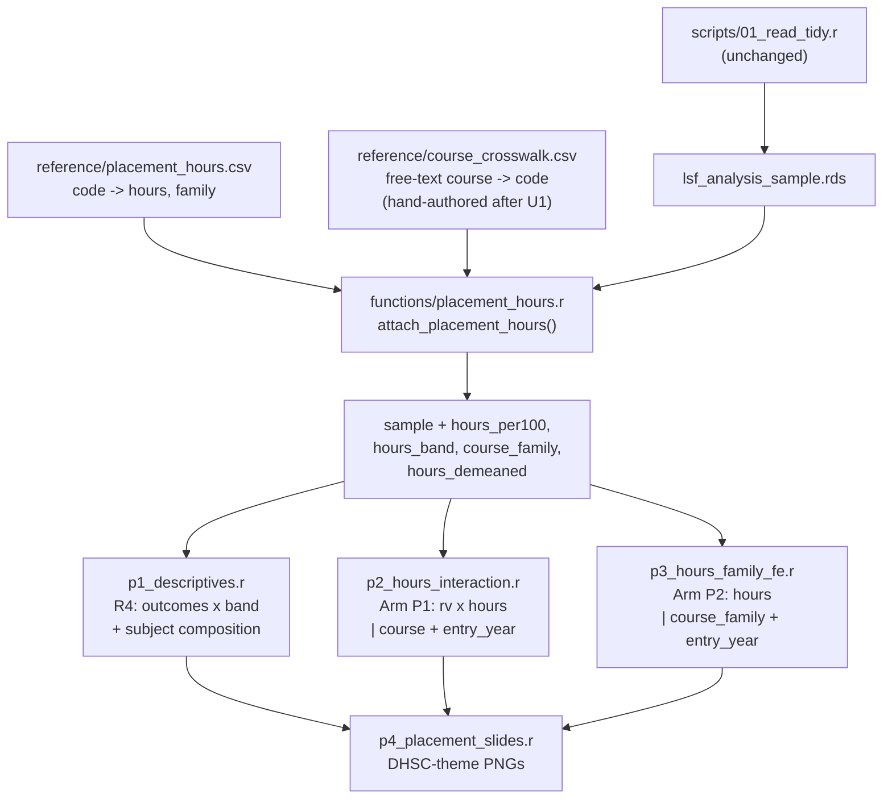

# feat: Placement hours — do students on long-placement courses experience LSF differently?

**Target repo:** LSF_2026
**Branch:** `feat/placement-hours`, cut from `feat/real-lsf-controlled`

---

## Goal Capsule

Attach DHSC programme-level average placement hours per year (FY26/27) to the LSF survey panel, then test whether students on long-placement courses report different financial experience and leaving behaviour than students on short-placement courses.

The mechanism worth testing: heavy placement hours crowd out paid part-time work, so the same real grant has to stretch further. If that is true, thin real LSF should bite harder on high-placement courses. That is a testable interaction, not a story.

All results are associational. No unfunded control group, no randomisation, single time-invariant hours snapshot.

---

## Problem Frame

Placement hours are a **programme-level, time-invariant** attribute in the supplied data — one figure per programme code, FY26/27, applied retrospectively across waves 2020–2026.

Every model in the repo (`functions/estimate_utils.r`, `fit_feglm`, default `fe = "course + entry_year"`) uses course fixed effects. **Course FE absorbs placement hours completely.** A hours main effect and a course FE cannot both be estimated — perfect collinearity, `fixest` will silently drop the term. This is the central constraint the plan is built around, not a caveat bolted on at the end.

Second constraint, equally important: **the high-hours band is almost entirely nursing and midwifery.** Of the 23 programmes with a value, everything above 660 hours is a nursing field, midwifery, ODP, or Dental Therapist. "High placement hours" is close to a synonym for "is a nurse". Any unadjusted comparison across hours bands is a comparison of nurses against everyone else, wearing a different label. The plan makes this visible rather than letting a reader discover it.

### Supplied data

24 programme codes; 23 carry a value. Sonography (Direct Entry, 2040) is `-`. Undergraduate Clinical Pharmacy (1229) arrives as `143 ` with a trailing space.

Three dental categories overlap in ways that will not map cleanly onto free-text survey answers: Dental Hygienists (1070, 231), Dental Hygiene Therapy (1071, 375), Dental Therapist (1230, 747). A student writing "dental hygiene" could belong to any of the three, and the hours differ three-fold. This is the highest-risk part of the crosswalk.

### What we do not have

`course` in the survey panel is free text, read verbatim (`scripts/01_read_tidy.r` stage D, `col_select` includes `course`; `functions/clean_lsf.r` only fixes encoding and whitespace). There is no canonical course list in the repo. **The crosswalk cannot be authored without first seeing the actual distinct values and their counts on the work machine.** U1 produces that audit; the crosswalk is completed by hand afterwards.

---

## Requirements

- **R1** — A reference table mapping DHSC programme code to average placement hours per year, versioned in the repo alongside `reference/lsf_awards.csv` and `reference/cpih_index.csv`.
- **R2** — A crosswalk from the survey's free-text `course` values to programme codes, with an explicit unmatched category and a reported match rate. No silent fuzzy matching.
- **R3** — Hours available on the analysis sample as: continuous (per 100 hours), student-weighted tertile band, course-family, and family-demeaned hours.
- **R4** — Descriptive comparison of existing outcomes by hours band, published **with** subject composition alongside so the confounding is visible in the same table.
- **R5** — Arm P1: real LSF × hours interaction with `course + entry_year` FE retained.
- **R6** — Arm P2: hours main effect under course-family FE, framed as exploratory.
- **R7** — Match-rate and cell-count diagnostics reported before any estimate, with the existing disclosure-control convention applied.
- **R8** — No student-level data written to the repo. Outputs to the secure derived/outputs folders only, per the existing `derived_dir()` / `outputs_dir()` convention.

---

## Key Technical Decisions

**KTD1 — Course FE is retained for the headline arm; the hours main effect is conceded.**
Arm P1 estimates `rv_pound × placement_hours` under `course + entry_year`. The hours main effect is absorbed by design and reported as absorbed, not as null. The interaction survives because real value varies within course by place and year — precisely the variation `scripts/05_real_value_controlled.r` already exploits. Chosen over dropping course FE to recover a main effect, which would buy an uninterpretable coefficient at the cost of every subject confounder.

**KTD2 — Family FE is the exploratory route to a main effect, not the headline.**
Replacing course FE with course-family FE lets hours vary within family. Nursing spans 694–829 (Children's 694, Adult 706, MH 714, LD 718, Dual field 741, Midwifery 757, Dual professional 829) — a genuine but narrow 135-hour range across a population with a shared regulator and similar demography. Dental spans 231–747, a three-fold contrast, but with the smallest cell counts and the worst crosswalk risk. Reported with the confounding stated in the chart caption, not the appendix.

**KTD3 — Hours enter as per-100-hours, not raw or z-scored.**
`rv_pound` is already interpreted per £1,000 (`pound_effect()` in `scripts/06_findings_pack.r`, `POUND_STEPS <- c(500, 1000)`). Per-100-hours keeps the interaction term readable in the same register: "per £1,000 less real value, per 100 extra placement hours". A z-score would make the interaction untranslatable into a slide sentence. Family-demeaned hours are also stored for the P2 arm.

**KTD4 — Tertile bands are cut on student counts, not programme counts.**
Cutting on the 23 programmes would put roughly eight programmes per band regardless of how many students sit in each. Nursing dominates the sample, so programme-cut bands would be badly unbalanced. Bands are cut so each holds a comparable share of students, and the cut points are reported.

**KTD5 — Unmatched courses are a reported category, never dropped silently.**
Sonography has no hours value and stays `NA`. Free-text values that do not map get `programme_code = NA` and are counted in the diagnostic output. Match rate is printed before any model runs. A crosswalk that quietly loses a third of the sample is worse than no crosswalk.

**KTD6 — Dental is estimated but flagged in-chart.**
The dental three-way ambiguity is the widest hours contrast available and the weakest data. It runs, and every output carrying it says so on the face of the chart.

---

## High-Level Technical Design

Data flow, sitting downstream of the existing pipeline without modifying it:



Identification, stated as a spec ladder:

| Arm | Model | Hours identified off | Strength |
|---|---|---|---|
| P0 descriptive | means by band | nothing — raw contrast | Unadjusted. Band ≈ nursing vs not |
| P1 interaction | `y ~ rv_pound * hours_per100 \| course + entry_year` | within-course variation in real value | Headline. Hours main effect absorbed by design |
| P2 family FE | `y ~ hours_per100 + demog \| course_family + entry_year` | between-course, within-family | Exploratory. Subject confounding not controlled |

---

## Output Structure

```
reference/
  placement_hours.csv          # NEW: code, name, hours, family
  course_crosswalk.csv         # NEW: course_raw, programme_code, n, note
functions/
  placement_hours.r            # NEW: load, attach, band, family-demean
scripts/
  p0_audit_course_strings.r    # NEW: distinct course values + counts
  p1_descriptives.r            # NEW: R4
  p2_hours_interaction.r       # NEW: Arm P1
  p3_hours_family_fe.r         # NEW: Arm P2
  p4_placement_slides.r        # NEW: slide PNGs
PLACEMENT_HOURS_ARMS.md        # NEW: design doc, mirrors REAL_VALUE_THREE_ARMS.md
RUNME_PLACEMENT_HOURS.txt      # NEW: run order, mirrors RUNME_COMMS_SLIDES.txt
```

Per-unit `**Files:**` remain authoritative. The implementer may relocate if a better layout appears.

---

## Implementation Units

### U1. Reference data and course-string audit

**Goal:** Get the supplied hours table into the repo, and produce the distinct-`course` audit needed before any crosswalk can be written.

**Requirements:** R1, R2

**Dependencies:** none

**Files:**
- `reference/placement_hours.csv` (create)
- `scripts/p0_audit_course_strings.r` (create)

**Approach:**
`placement_hours.csv` carries `programme_code, programme_name, hours_per_year, course_family`. Sonography is written with an empty `hours_per_year`, not zero — zero would silently enter every mean. Clinical Pharmacy's trailing space is stripped at authoring time.

Family assignment: `nursing` (1212, 1213, 1216, 1217, 1218, 1219, 1231), `dental` (1070, 1071, 1230), `ahp` (1214, 1215, 1220, 1221, 1222, 1223, 1224, 1225, 1226, 1227, 1228, 2040), `other` (1229, 1232). Midwifery sits in `nursing` on regulator and course-structure grounds; if the implementer disagrees after seeing counts, note it rather than moving it silently.

`p0_audit_course_strings.r` reads `lsf_analysis_sample.rds` from `derived_dir()`, prints distinct `course` with counts descending, and writes a template `course_crosswalk.csv` with `programme_code` left blank for hand-completion. The audit output is a count table only — no free text leaves the secure folder if any value could identify a student.

**Patterns to follow:** existing `reference/` CSVs (`lsf_awards.csv`, `cpih_index.csv`); `derived_dir()` / `outputs_dir()` from `functions/paths.r`; `progress()` messaging as used throughout `scripts/01_read_tidy.r`.

**Test scenarios:**
- `read_csv("reference/placement_hours.csv")` returns 24 rows, exactly one with `NA` hours (2040), and `hours_per_year` is numeric — not character with a stray space.
- Every `programme_code` is unique; every `course_family` is one of the four allowed values.
- The audit script run against a sample with an unexpected `NA` in `course` reports it as its own row rather than erroring.
- Audit output contains no column other than the course string and a count.

**Verification:** the audit table exists, its row count matches the number of distinct `course` values, and its counts sum to `nrow(sample)`.

---

### U2. Attach hours to the analysis sample

**Goal:** One function that takes the analysis sample and returns it with the hours variables attached, plus a match diagnostic.

**Requirements:** R2, R3, R7

**Dependencies:** U1, and a hand-completed `reference/course_crosswalk.csv`

**Files:**
- `functions/placement_hours.r` (create)
- `reference/course_crosswalk.csv` (completed by hand on the work machine after U1)

**Approach:**
`attach_placement_hours(sample)` joins crosswalk then hours, and adds:
- `hours_per_year` — raw, `NA` where unmatched or Sonography
- `hours_per100` — `hours_per_year / 100`
- `course_family` — factor
- `hours_band` — ordered low/medium/high, cut on student-weighted tertiles (KTD4), cut points returned as an attribute so the descriptive script can print them
- `hours_demeaned` — `hours_per100` minus the family mean, the P2 arm's working variable

Returns a `match_report` attribute: matched count, unmatched count, match rate, and the top unmatched strings by frequency. `placement_match_report(sample)` prints it.

Exact string join only, after `str_squish()` and case-folding. No fuzzy matching (KTD5) — a wrong dental match is worse than an honest `NA`.

**Patterns to follow:** `functions/real_value.r` for the join-and-attach shape; `functions/build_course_length.r` for a lookup returning a named vector; `tidy_groups()` in `functions/labels.r` for the `min_n` suppression convention.

**Test scenarios:**
- A sample whose `course` values all match returns 100% match rate and no `NA` in `hours_per100`.
- A sample containing an unmatched string returns it in `match_report`, sets `hours_per100` to `NA` for those rows, and does not drop them from the frame.
- A Sonography student matches a programme code but carries `NA` hours, and is excluded from band assignment rather than landing in the low band.
- `hours_band` cut points produce three bands whose student counts are within a stated tolerance of each other, and the attribute reports the cut points.
- `hours_demeaned` sums to approximately zero within each family.
- Case and whitespace variants of the same course string ("Adult Nurse", "adult nurse ") map to the same code.

**Verification:** match report prints, band counts are balanced on students, and the returned frame has the same row count as the input.

---

### U3. Descriptives with subject composition alongside

**Goal:** The honest unadjusted picture — outcomes by hours band, published next to what each band is actually made of.

**Requirements:** R4, R7

**Dependencies:** U2

**Files:**
- `scripts/p1_descriptives.r` (create)

**Approach:**
For each band, report `left_before_finish`, `confidence`, `fund_availability`, `grant_influence`, and `grant_helps_stay` — the outcomes `scripts/06_findings_pack.r` already uses in `SURVEY_VARS`, so the arms speak the same language as the existing pack.

Every outcome table is emitted **paired** with a composition table: share of each band by `course_family` and by top programmes. The composition table is not an appendix. If the high band is 90% nursing, that number appears next to the outcome difference, in the same output file.

Cells below the disclosure minimum are suppressed following the `min_n` convention in `functions/labels.r`.

**Execution note:** write the composition table first and look at it before writing the outcome comparison. If the high band is overwhelmingly one family, that finding shapes how U5 and U6 get framed, and it is better known now than after the slides are built.

**Patterns to follow:** `scripts/06_findings_pack.r` output-pack structure (dated folder under `outputs_dir()`, `00_README.txt`, `cat_both()` for a plain-English numbers file).

**Test scenarios:**
- Outcome table has one row per band per outcome, with n reported for each.
- Composition shares sum to 100% within each band.
- A band containing a family below `min_n` has that cell suppressed, and the suppression is marked rather than blank.
- Students with `NA` hours appear in an explicit "unmatched" row, not silently absent.
- No student-level column reaches the output folder.

**Verification:** the pack folder contains both an outcome and a composition table for every outcome, and the numbers file states the band cut points and the match rate.

---

### U4. Arm P1 — real LSF × hours interaction

**Goal:** The headline estimate. Does thin real value predict leaving more strongly on high-placement courses?

**Requirements:** R5, R7

**Dependencies:** U2

**Files:**
- `scripts/p2_hours_interaction.r` (create)

**Approach:**
`y ~ rv_pound * hours_per100 | course + entry_year`, binomial, via the existing `fit_feglm()` / `pull_or()` path in `functions/estimate_utils.r`. `pull_or()` already handles interaction term-name variants — reuse it rather than writing new coefficient extraction.

`rv_pound` uses `PRIMARY <- "real_value_rent_ttwa_cpih"`, matching `scripts/06_findings_pack.r`, so the arm sits on the same headline construct as the existing work.

Report the interaction as a marginal difference in the £1,000 effect between a low-hours and a high-hours course, in the register `pound_effect()` already produces. A raw interaction coefficient is not a finding anyone can read.

Run the hazard variant too — `left_next` with `course + year` FE, matching `FE_PANEL` — so the arm answers the same question on the panel that Arm 2 of the real-value work answers.

State in output that the hours main effect is absorbed by course FE by design. Do not report it as a null result.

**Execution note:** before interpreting anything, print the within-course standard deviation of `rv_pound` split by hours band. If real value barely varies within course on high-hours courses, the interaction has no variation to work with and the estimate is noise regardless of its p-value. That diagnostic gates the arm.

**Test scenarios:**
- Model fits and the interaction term is recovered by `pull_or()` under whichever name `fixest` assigns it.
- `hours_per100` main effect is confirmed absent from the coefficient table, and the script says so explicitly rather than erroring.
- The within-course `rv_pound` variation diagnostic runs and prints per band before any estimate.
- Synthetic data with a known interaction sign recovers that sign.
- A sample where one band has fewer than a stated minimum of students reports insufficient support rather than returning a coefficient.
- Marginal effects translate back to the "£1,000 less real value" framing used in `06_findings_pack.r`.

**Verification:** interaction coefficient, its CI, the translated marginal difference, and the variation diagnostic all land in the output pack.

---

### U5. Arm P2 — hours under family fixed effects

**Goal:** An exploratory hours main effect, identified by comparing courses within the same family.

**Requirements:** R6, R7

**Dependencies:** U2, U3

**Files:**
- `scripts/p3_hours_family_fe.r` (create)

**Approach:**
`y ~ hours_per100 + demographics | course_family + entry_year`. Run per family as well as pooled, since nursing and dental are doing very different things: nursing offers a narrow range over a large sample, dental a wide range over a small one.

Report per-family the number of distinct programmes, the hours range, and student n before the coefficient. A family with two programmes and a 20-hour spread is not identifying anything, and the output should say so rather than print a number.

Every output carries the confounding statement on its face: this compares a midwife to an adult nurse, and placement hours are not the only thing that differs.

**Patterns to follow:** `scripts/05e_recruit_effect_slide.r` for the coefficient-plot-with-plain-English-methods treatment, which is the shape this arm's output should take.

**Test scenarios:**
- Pooled and per-family models fit; per-family results include programme count, hours range, and n.
- A family with a single programme returns a stated "no within-family variation" result rather than a dropped-term model.
- Dental output is tagged with the crosswalk-ambiguity flag.
- `hours_demeaned` and family-FE-on-raw-hours give equivalent coefficients, confirming the demeaning is correct.
- Demographic controls come from the existing entry-wave columns; no new derivation is introduced here.

**Verification:** a per-family table showing identifying variation alongside each coefficient, with families lacking variation marked rather than estimated.

---

### U6. Slides

**Goal:** DHSC-theme PNGs for the deck.

**Requirements:** R4, R5, R6

**Dependencies:** U3, U4, U5

**Files:**
- `scripts/p4_placement_slides.r` (create)

**Approach:**
Three slides: composition-and-outcome by band (the honest descriptive, confounding visible in the chart itself, not the notes), the P1 interaction as a marginal-effect comparison, and the P2 per-family coefficient plot.

Labels held locally as JSON, following the data-leak precaution already in place on `main` ("put slide labels into a local json to avoid data leak").

**Patterns to follow:** `functions/dhsc_theme.r`, `functions/plots.r`, `functions/deck_helpers.r`, `functions/grid_utils.r`; 16:9 PNG output convention from `RUNME_COMMS_SLIDES.txt`.

**Test scenarios:**
- Each slide renders at 16:9 with no clipped labels — the failure mode `05d` already hit twice and fixed with top headroom.
- The descriptive slide displays band composition without the reader having to consult a second output.
- Suppressed cells render as marked-suppressed, not as gaps.
- Slides regenerate from saved result tables without refitting models.

**Verification:** PNGs exist at the stated paths and open at the right aspect ratio.

---

### U7. Design doc and run order

**Goal:** The arms written down the way the real-value arms are, so the next person picking this up sees the constraint before the code.

**Requirements:** R1–R8

**Dependencies:** U1–U6

**Files:**
- `PLACEMENT_HOURS_ARMS.md` (create)
- `RUNME_PLACEMENT_HOURS.txt` (create)

**Approach:**
Mirror `REAL_VALUE_THREE_ARMS.md`: unit, X, Y, FE, scripts, counts, ignores, caveats per arm. Lead with the collinearity constraint and the nursing-dominates-the-high-band fact — both belong at the top, not in a limitations section at the bottom.

`RUNME_PLACEMENT_HOURS.txt` mirrors `RUNME_COMMS_SLIDES.txt`: pull line, `source()` order, expected output paths.

**Test expectation:** none — documentation.

**Verification:** run order in the RUNME matches the actual dependency order, and every script named exists.

---

## Scope Boundaries

**In scope:** crosswalk, hours variables, descriptives, two estimation arms, slides, docs.

**Out of scope:** any causal claim; changes to `01`–`08` or the existing real-value arms; new survey data; placement hours by year rather than the FY26/27 snapshot; placement *quality* or location, which is a different question with no data behind it.

### Deferred to Follow-Up Work

- Total placement burden as `hours_per_year × course_length`, using `build_course_lengths()`. A natural extension once the per-year variable behaves, but it compounds two estimates and should not be in the first pass.
- Placement hours interacted with the geographic real-value work (`g1_build_costofliving.r`) — long placements plus expensive travel is a plausible double burden, but it is a third dimension on an already thin cell structure.
- Hours as a moderator in the recruitment arm (Arm 3 of the real-value work).

---

## Risks

**Crosswalk failure is the project risk.** If free-text `course` values do not map cleanly, everything downstream inherits the damage. U1's audit runs before any commitment, and the match rate is a stated gate: below a threshold the implementer sets after seeing the audit, the honest move is to stop and report the match rate rather than model a mangled variable.

**The high band may be a nursing dummy.** If composition shows the high band is overwhelmingly nursing, the descriptive arm is a nursing-versus-everyone comparison and must be labelled as one. U3's execution note front-loads this check for exactly that reason.

**Interaction power.** The P1 arm needs within-course variation in real value to be present on high-hours courses specifically. U4's diagnostic gates on it. A precise-looking null with no underlying variation is the failure mode to avoid.

**Dental cell sizes.** The widest hours contrast has the smallest n and the worst matching. It runs, flagged, or not at all.

**Snapshot applied retrospectively.** FY26/27 hours are used for 2020 entrants. Programme placement requirements are regulator-set and change slowly, so this is defensible, but it is an assumption and belongs in the design doc rather than in nobody's head.

---

## Open Questions

- What match rate is acceptable before the crosswalk is trusted? Answerable only after U1's audit.
- Does the survey distinguish the three dental categories at all, or does everyone write "dental hygiene"? U1 answers this.
- Should midwifery sit in `nursing` or its own family? Depends on n; U1's counts decide it.
- Are demographic controls for U5 already on `lsf_analysis_sample.rds`, or do they need pulling from the demographics work on `feat/demographics-slides`? Resolve at U5, not before.

---

## Definition of Done

- `reference/placement_hours.csv` and a completed `reference/course_crosswalk.csv` exist, with match rate reported.
- `attach_placement_hours()` returns the four hours variables and a match report, and passes its scenarios.
- Descriptive output pairs every outcome with its composition table.
- Arm P1 reports the interaction, its translated marginal effect, and the variation diagnostic, and states that the hours main effect is absorbed.
- Arm P2 reports per-family identifying variation alongside every coefficient.
- Slides render at 16:9 with labels intact.
- `PLACEMENT_HOURS_ARMS.md` leads with the collinearity constraint and the composition finding.
- No student-level data anywhere in the repo.

---

## Sources

- Placement hours table supplied by the user, 2026-07-20 (DHSC, FY26/27, excluding adjustments).
- `REAL_VALUE_THREE_ARMS.md` on `feat/real-lsf-controlled` — arm-documentation pattern this plan mirrors.
- `functions/estimate_utils.r`, `scripts/06_findings_pack.r` — the estimation and reporting conventions reused throughout.
